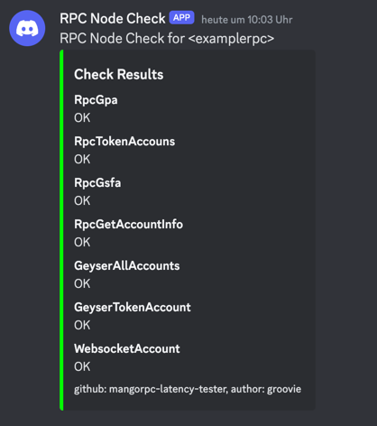

## Run from console

### check alive

```bash
RUST_LOG=info,rpc_node_check_alive=debug
RPCNODE_LABEL=nodename
CHECKS_ENABLED=RpcGpa,RpcTokenAccouns,RpcGsfa,RpcGetAccountInfo,GeyserAllAccounts,GeyserTokenAccount,WebsocketAccount
RPC_HTTP_ADDR=https://...
RPC_WS_ADDR=wss://...
GRPC_ADDR=http://....:10000/
GRPC_X_TOKEN=...
DISCORD_WEBHOOK=https://discord.com/api/webhooks/abcedfgh

cargo run check-alive
```

- `DISCORD_WEBHOOK` is optional

### measure slot latency

TODO: document usage

```bash
cargo run measure-slot-latency -- --help
```

### watch measure tx mined speeds

the same as above but will do the action every n seconds

```bash
cargo run watch-measure-send-transaction -- --watch-interval 600
```

## Example output

```
2024-06-07T07:26:48.391467Z DEBUG rpc_node_check_alive: checks_enabled unparsed: Gpa, TokenAccouns, Gsfa, GetAccountInfo, GeyserAllAccounts, GeyserTokenAccount, WebsocketAccount
2024-06-07T07:26:48.391721Z  INFO rpc_node_check_alive: checks enabled for rpcnode <examplerpc>: [Gpa, TokenAccouns, Gsfa, GetAccountInfo, GeyserAllAccounts, GeyserTokenAccount, WebsocketAccount]
2024-06-07T07:26:48.401052Z  INFO rpc_node_check_alive: all 7 tasks started...
2024-06-07T07:26:48.459314Z DEBUG rpc_node_check_alive::checks: Token Account: [10, 48, 151, 253, 112, 168, 12, 111, 238, 19, 187, 124, 207, 230, 113, 108, 198, 113, 188, 77, 26, 238, 240, 13, 119, 247, 220, 130, 21, 24, 229, 187]
2024-06-07T07:26:48.459412Z DEBUG rpc_node_check_alive::checks: Token Account: [244, 123, 227, 71, 4, 27, 137, 78, 194, 25, 183, 155, 89, 115, 74, 109, 205, 223, 35, 75, 0, 89, 132, 62, 93, 231, 217, 0, 27, 24, 90, 242]
2024-06-07T07:26:48.459438Z DEBUG rpc_node_check_alive::checks: Token Account: [255, 197, 54, 215, 59, 239, 111, 115, 190, 227, 246, 193, 120, 118, 144, 230, 159, 82, 89, 253, 210, 17, 206, 181, 211, 232, 122, 77, 251, 162, 63, 60]
2024-06-07T07:26:48.459461Z DEBUG rpc_node_check_alive::checks: Token Account: [199, 239, 190, 245, 79, 77, 73, 240, 252, 152, 19, 232, 55, 12, 214, 66, 109, 82, 9, 24, 131, 116, 199, 100, 161, 207, 147, 16, 18, 103, 250, 216]
2024-06-07T07:26:48.459539Z  INFO rpc_node_check_alive: one more task completed <GeyserTokenAccount>, 6/7 left
2024-06-07T07:26:48.471706Z DEBUG rpc_node_check_alive::checks: Account from geyser: [138, 87, 123, 76, 70, 46, 233, 147, 230, 170, 78, 57, 219, 238, 253, 146, 228, 170, 80, 43, 212, 183, 154, 175, 40, 127, 19, 126, 96, 55, 185, 76]
2024-06-07T07:26:48.471750Z DEBUG rpc_node_check_alive::checks: Account from geyser: [252, 11, 216, 172, 5, 112, 202, 54, 136, 198, 58, 17, 241, 2, 21, 19, 147, 46, 110, 181, 38, 155, 213, 37, 2, 142, 115, 184, 17, 111, 89, 199]
2024-06-07T07:26:48.471777Z DEBUG rpc_node_check_alive::checks: Account from geyser: [146, 103, 4, 125, 157, 234, 18, 229, 247, 139, 185, 201, 236, 6, 84, 85, 13, 223, 106, 140, 192, 226, 81, 32, 107, 159, 109, 159, 146, 104, 196, 191]
2024-06-07T07:26:48.471808Z DEBUG rpc_node_check_alive::checks: Account from geyser: [85, 186, 223, 50, 94, 45, 163, 177, 7, 70, 67, 92, 242, 148, 252, 163, 244, 223, 145, 116, 189, 205, 100, 140, 91, 104, 110, 186, 169, 123, 174, 50]
2024-06-07T07:26:48.471868Z  INFO rpc_node_check_alive: one more task completed <GeyserAllAccounts>, 5/7 left
2024-06-07T07:26:49.608846Z DEBUG rpc_node_check_alive::checks: Token accounts: 1
2024-06-07T07:26:49.609727Z  INFO rpc_node_check_alive: one more task completed <TokenAccouns>, 4/7 left
2024-06-07T07:26:49.610565Z DEBUG rpc_node_check_alive::checks: Account info: Account { lamports: 1141440, data.len: 36, owner: BPFLoaderUpgradeab1e11111111111111111111111, executable: true, rent_epoch: 18446744073709551615, data: 02000000ac038fba657d72b99a76ff3a3a7237b28ba1eade31cc3435710eb16b9e4eac42 }
2024-06-07T07:26:49.610787Z  INFO rpc_node_check_alive: one more task completed <GetAccountInfo>, 3/7 left
2024-06-07T07:26:49.614748Z DEBUG rpc_node_check_alive::checks: Signatures for Address SCbotdTZN5Vu9h4PgSAFoJozrALn2t5qMVdjyBuqu2c: 42
2024-06-07T07:26:49.614955Z  INFO rpc_node_check_alive: one more task completed <Gsfa>, 2/7 left
2024-06-07T07:26:50.662348Z DEBUG rpc_node_check_alive::checks: SysvarC1ock: "{\"jsonrpc\":\"2.0\",\"method\":\"accountNotification\",\"params\":{\"result\":{\"context\":{\"slot\":270376319},\"value\":{\"lamports\":1169280,\"data\":\"7YJ4bFoS5PBKtui5N6xj6cPJnQsoJoY1Ndgp6JtMsJUpkae9i3p7wPD\",\"owner\":\"Sysvar1111111111111111111111111111111111111\",\"executable\":false,\"rentEpoch\":18446744073709551615,\"space\":40}},\"subscription\":9656896}}"
2024-06-07T07:26:51.070425Z DEBUG rpc_node_check_alive::checks: SysvarC1ock: "{\"jsonrpc\":\"2.0\",\"method\":\"accountNotification\",\"params\":{\"result\":{\"context\":{\"slot\":270376320},\"value\":{\"lamports\":1169280,\"data\":\"7bBDDTMWcTQLYcGvG4p8pAQnzQ9nb8FY6zjNF6fRYtwaU1fkBBbjUB1\",\"owner\":\"Sysvar1111111111111111111111111111111111111\",\"executable\":false,\"rentEpoch\":18446744073709551615,\"space\":40}},\"subscription\":9656896}}"
2024-06-07T07:26:51.506507Z DEBUG rpc_node_check_alive::checks: SysvarC1ock: "{\"jsonrpc\":\"2.0\",\"method\":\"accountNotification\",\"params\":{\"result\":{\"context\":{\"slot\":270376322},\"value\":{\"lamports\":1169280,\"data\":\"7e4Mqeub9XdMCJqmA2fYXiSHCPRmsSy4qMmvPtSVEVQLBGzfdWZrPhH\",\"owner\":\"Sysvar1111111111111111111111111111111111111\",\"executable\":false,\"rentEpoch\":18446744073709551615,\"space\":40}},\"subscription\":9656896}}"
2024-06-07T07:26:52.053034Z DEBUG rpc_node_check_alive::checks: SysvarC1ock: "{\"jsonrpc\":\"2.0\",\"method\":\"accountNotification\",\"params\":{\"result\":{\"context\":{\"slot\":270376322},\"value\":{\"lamports\":1169280,\"data\":\"7gwWTrTfgbrMr1Qc3zWxFGTmQNhm9mgbZipUYgDYv5s5tYKb5qXyKDZ\",\"owner\":\"Sysvar1111111111111111111111111111111111111\",\"executable\":false,\"rentEpoch\":18446744073709551615,\"space\":40}},\"subscription\":9656896}}"
2024-06-07T07:26:52.054283Z  INFO rpc_node_check_alive: one more task completed <WebsocketAccount>, 1/7 left
2024-06-07T07:26:54.291176Z DEBUG rpc_node_check_alive::checks: Program accounts: 12462
2024-06-07T07:26:54.292933Z  INFO rpc_node_check_alive: one more task completed <Gpa>, 0/7 left
2024-06-07T07:26:54.293023Z  INFO rpc_node_check_alive: sending to discord is disabled
2024-06-07T07:26:54.293034Z  INFO rpc_node_check_alive: rpcnode <examplerpc> - all 7 tasks completed: [GeyserTokenAccount, GeyserAllAccounts, TokenAccouns, GetAccountInfo, Gsfa, WebsocketAccount, Gpa]
```



## deployment on fly

install flyctl then...

- `fly apps create`
- `fly secrets set --config fly.toml KEY="value"` for .env vars
- `fly deploy --config fly.toml --ha=false --remote-only`
- `fly status` for status
- `fly logs` for logs

